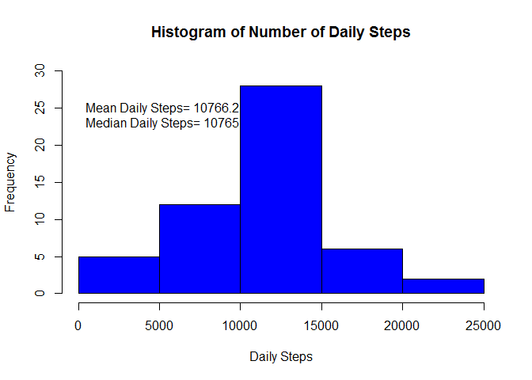
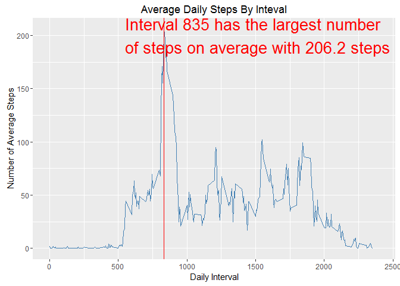
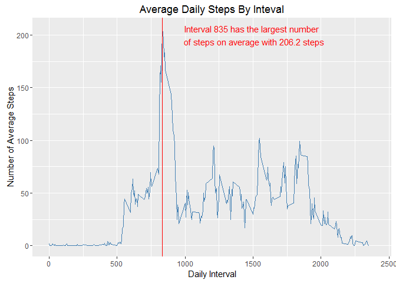
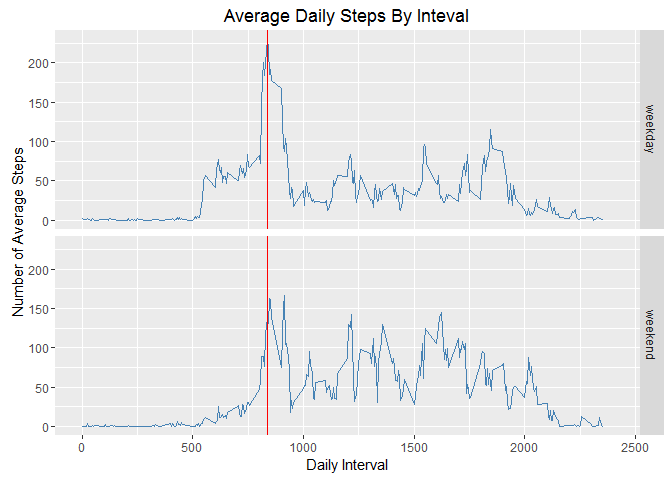

# Reproducible Research: Peer Assessment 1
D Risius  


## Loading and preprocessing the data

```r
setwd("~/Data_Science_Specialization/5_ReproducibleResearch/CourseProj1/RepData_PeerAssessment1")

stepData <- read.csv("activity/activity.csv")
head(stepData)
```

```
##   steps       date interval
## 1    NA 2012-10-01        0
## 2    NA 2012-10-01        5
## 3    NA 2012-10-01       10
## 4    NA 2012-10-01       15
## 5    NA 2012-10-01       20
## 6    NA 2012-10-01       25
```

```r
str(stepData) # date is a factor we want to change to date
```

```
## 'data.frame':	17568 obs. of  3 variables:
##  $ steps   : int  NA NA NA NA NA NA NA NA NA NA ...
##  $ date    : Factor w/ 61 levels "2012-10-01","2012-10-02",..: 1 1 1 1 1 1 1 1 1 1 ...
##  $ interval: int  0 5 10 15 20 25 30 35 40 45 ...
```

```r
stepData$date <- as.Date(stepData$date)
stepData$interval <- as.numeric(stepData$interval)
```

## What is mean total number of steps taken per day?

```r
x <- tapply(stepData$steps,stepData$date, FUN = sum) #by steps by day

#make a data frame of daily steps
dailySums <- data.frame(date=names(x), steps = as.vector(x))
hist(x, col = "blue", breaks = 7, main = "Histogram of Number of Daily Steps", 
     xlab = "Daily Steps", ylim = c(0,30))
text(x = 0, y= 25,paste("Mean Daily Steps= ", round(mean(x, na.rm = TRUE),1), 
     sep=""), pos = 4)
text(x = 0, y= 23,paste("Median Daily Steps= ", round(median(x, na.rm = TRUE),0), 
                        sep=""), pos = 4)
```



## What is the average daily activity pattern?

```r
library(ggplot2)
y <- tapply(stepData$steps,stepData$interval, FUN = mean, na.rm = T) #by steps by day
intervalMeans <- data.frame(interval = as.numeric(names(y)), steps = as.vector(y))
maxInt <- intervalMeans[which.max(intervalMeans$steps),1]
maxStep <- round(max(intervalMeans$steps),1)
g <- ggplot(intervalMeans, aes(x=interval, y=steps))
g <- g + geom_line(col = "steelblue") + 
  geom_vline(xintercept= maxInt, col = "red") +
  annotate("text", label = paste("Interval " ,maxInt, " has the largest number \n of steps on average with ",
        maxStep, " steps" , sep=""), x = 1500, y = 200, size = 7, colour = "red") +
   labs(x = "Daily Interval") + #add labels
   labs(y = "Number of Average Steps") +
   labs(title = "Average Daily Steps By Inteval", size = 20) +
   xlim(0,2400)
g
```



## Imputing missing values

```r
library(dplyr)
```

```
## 
## Attaching package: 'dplyr'
```

```
## The following objects are masked from 'package:stats':
## 
##     filter, lag
```

```
## The following objects are masked from 'package:base':
## 
##     intersect, setdiff, setequal, union
```

```r
z <- stepData$steps
#impute the mean in a new dataset to get the missing numbers and then sort so its same as original
imputeMeans <- merge(stepData, intervalMeans, by = "interval")
colnames(imputeMeans) <- c("interval", "steps", "date", "intervalMean")
missing <- which(is.na(imputeMeans$steps))
imputeMeans$steps[missing] <- imputeMeans$intervalMean[missing] 
imputeMeans <- arrange(imputeMeans, date, interval )
```

## What is mean total number of steps taken per day?

```r
x <- tapply(imputeMeans$steps,imputeMeans$date, FUN = sum) #by steps by day

#make a data frame of daily steps using the imputted data
dailySums <- data.frame(date=names(x), steps = as.vector(x))
hist(x, col = "blue", breaks = 7, main = "Histogram of Number of Daily Steps", 
     xlab = "Daily Steps", ylim = c(0,30))
text(x = 0, y= 25,paste("Mean Daily Steps= ", round(mean(x, na.rm = TRUE),1), 
                        sep=""), pos = 4)
text(x = 0, y= 23,paste("Median Daily Steps= ", round(median(x, na.rm = TRUE),0), 
                        sep=""), pos = 4)
```


## Are there differences in activity patterns between weekdays and weekends?

```r
imputeMeans$day <- weekdays(imputeMeans$date)
imputeMeans$dayClass <- "weekday"
weekend <- imputeMeans$day == "Saturday" | imputeMeans$day == "Sunday"
imputeMeans$dayClass[weekend] <- "weekend"
intervalMeans2 <- aggregate(imputeMeans$steps, by = list(imputeMeans$interval, imputeMeans$dayClass), FUN = mean, na.rm = TRUE)
colnames(intervalMeans2) <- c("interval", "dayClass", "steps")
maxInt <- intervalMeans[which.max(intervalMeans2$steps),1]
maxStep <- round(max(intervalMeans$steps),1)
g <- ggplot(intervalMeans2, aes(x=interval, y=steps))
g <- g + facet_grid(dayClass~ . ) + geom_line(col = "steelblue") + 
  geom_vline(xintercept= maxInt, col = "red") +
  labs(x = "Daily Interval") + #add labels
  labs(y = "Number of Average Steps") +
  labs(title = "Average Daily Steps By Inteval", size = 20) +
  xlim(0,2400)
g
```


