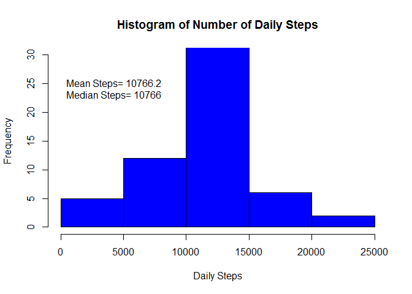

# Reproducible Research: Peer Assessment 1

## Loading and preprocessing the data


```r
stepData <- read.csv("activity/activity.csv")
head(stepData)
```

```
##   steps       date interval
## 1    NA 2012-10-01        0
## 2    NA 2012-10-01        5
## 3    NA 2012-10-01       10
## 4    NA 2012-10-01       15
## 5    NA 2012-10-01       20
## 6    NA 2012-10-01       25
```

```r
str(stepData) # date is a factor we want to change to date
```

```
## 'data.frame':	17568 obs. of  3 variables:
##  $ steps   : int  NA NA NA NA NA NA NA NA NA NA ...
##  $ date    : Factor w/ 61 levels "2012-10-01","2012-10-02",..: 1 1 1 1 1 1 1 1 1 1 ...
##  $ interval: int  0 5 10 15 20 25 30 35 40 45 ...
```

Change the date column from character to date class.  Change the interval column to numeric class for ease of plotting.


```r
stepData$date <- as.Date(stepData$date)
stepData$interval <- as.numeric(stepData$interval)
```

## What is mean total number of steps taken per day?

```r
#make an array of total steps by each day
x <- tapply(stepData$steps,stepData$date, FUN = sum) #by steps by day

#make a data frame of daily steps
dailySums <- data.frame(date=names(x), steps = as.vector(x))

hist(x, col = "blue", breaks = 7, main = "Histogram of Number of Daily Steps", 
     xlab = "Daily Steps", ylim = c(0,30))
text(x = 0, y= 25,paste("Mean Steps= ", round(mean(x, na.rm = TRUE),1), 
     sep=""), pos = 4)
text(x = 0, y= 23,paste("Median Steps= ", round(median(x, na.rm = TRUE),0), 
                        sep=""), pos = 4)
```


```r
dev.copy(png, file = "instructions_fig/dailyHistogram.png")
```

```
## png 
##   3
```

```
## png 
##   3
```
From the histogram we can see that the fitbit user typically walks between ten to fifteen thousand daily steps in a day.

## What is the average daily activity pattern?
For this question, the ggplot2 package was used. Again, the tapply function was used to get the mean from each interval.  Since ggplot won't recognize an array, the data needed to be converted into a data frame prior to plotting.

```r
library(ggplot2)
y <- tapply(stepData$steps,stepData$interval, FUN = mean, na.rm = T) #by steps by day
intervalMeans <- data.frame(interval = as.numeric(names(y)), steps = as.vector(y))
maxInt <- intervalMeans[which.max(intervalMeans$steps),1]
maxStep <- round(max(intervalMeans$steps),1)

g <- ggplot(intervalMeans, aes(x=interval, y=steps))
g <- g + geom_line(col = "steelblue") + 
  geom_vline(xintercept= maxInt, col = "red") +
  annotate("text", label = paste("Interval " ,maxInt, " has the largest number \n of steps on average with ",
        maxStep, " steps" , sep=""), x = 1500, y = 200, size = 4, colour = "red") +
   labs(x = "Daily Interval") + #add labels
   labs(y = "Number of Average Steps") +
   labs(title = "Average Daily Steps By Inteval", size = 10) +
   xlim(0,2400)
g
```


```r
dev.copy(png, file = "instructions_fig/intervalMeans.png")
```

```
## png 
##   4
```

```
## png 
##   3
```

The plot shows that steps tend to spike in the 800 interval range every day and the largest average steps per interval occurs on interval 835. 

## Imputing missing values

To impute missing values in the original data set, the overall interval means were used.  To achieve this, the original data set was first merged with the summary data set of interval means.  This creates a new column with the interval means.  Next, the missing step values are identified and imputed with the mean interval values.   


```r
library(dplyr)
```

```
## 
## Attaching package: 'dplyr'
```

```
## The following objects are masked from 'package:stats':
## 
##     filter, lag
```

```
## The following objects are masked from 'package:base':
## 
##     intersect, setdiff, setequal, union
```

```r
z <- stepData$steps
#impute the mean in a new dataset to get the missing numbers and then sort so its same as original
imputeMeans <- merge(stepData, intervalMeans, by = "interval")
colnames(imputeMeans) <- c("interval", "steps", "date", "intervalMean")
missing <- which(is.na(imputeMeans$steps))
imputeMeans$steps[missing] <- imputeMeans$intervalMean[missing] 
imputeMeans <- arrange(imputeMeans, date, interval )
```


# What is the new mean total number of steps taken per day for the imputed data?

The figure below shows that imputing missing values did not significantly change the overall mean or median of the daily steps.


```r
x <- tapply(imputeMeans$steps,imputeMeans$date, FUN = sum) #by steps by day

#make a data frame of daily steps using the imputted data
dailySums <- data.frame(date=names(x), steps = as.vector(x))

hist(x, col = "blue", breaks = 7, main = "Histogram of Number of Daily Steps", 
     xlab = "Daily Steps", ylim = c(0,30))
text(x = 0, y= 25,paste("Mean Steps= ", round(mean(x, na.rm = TRUE),1), 
                        sep=""), pos = 4)
text(x = 0, y= 23,paste("Median Steps= ", round(median(x, na.rm = TRUE),0), 
                        sep=""), pos = 4)
```



```r
dev.copy(png, file = "instructions_fig/imputedDailyMeans.png")
```

```
## png 
##   5
```

```
## png 
##   3
```

## Are there differences in activity patterns between weekdays and weekends?

```r
imputeMeans$day <- weekdays(imputeMeans$date)
imputeMeans$dayClass <- "weekday"
weekend <- imputeMeans$day == "Saturday" | imputeMeans$day == "Sunday"
imputeMeans$dayClass[weekend] <- "weekend"
intervalMeans2 <- aggregate(imputeMeans$steps, by = list(imputeMeans$interval, imputeMeans$dayClass), FUN = mean, na.rm = TRUE)
colnames(intervalMeans2) <- c("interval", "dayClass", "steps")
maxInt <- intervalMeans[which.max(intervalMeans2$steps),1]
maxStep <- round(max(intervalMeans$steps),1)

g <- ggplot(intervalMeans2, aes(x=interval, y=steps))
g <- g + facet_grid(dayClass~ . ) + geom_line(col = "steelblue") + 
  labs(x = "Daily Interval") + #add labels
  labs(y = "Number of Average Steps") +
  labs(title = "Average Daily Steps By Inteval", size = 20) +
  xlim(0,2400)
g
```


```r
dev.copy(png, file = "instructions_fig/weekdayWeekendCompare.png")
```

```
## png 
##   6
```

```
## png 
##   3
```
When we compare the weekday and weekend charts we can see a few key differences.  First, during the weekend, the user takes a little while to get moving (around interval 700) but once they get moving, they are fairly active compared to the weekdays until they become inactive at around interval 2000.  In contrast, during the weekday, the user seems to wake up at around 500, activity spikes at around interval 700 to 900, presumably while they are walking to work or school, then remains fairly inactive the rest of the day compared to the weekend.
